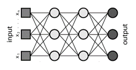

# ML vs DL
* All the machine task that can be done using ML , can also be done using DL with more accuracy.
* DL learning is dense form of ML, so accuracy increases.

# Deep Learning motivation from Bilogical neural network
* In the brain of living beings, neurons are responsible for any information interpreter.

* Network of neurons is called Neural network. In case of machine, neural network aka **Artificial Neural Network (ANN)** or **Deep Neural Network**

# Deep Learning Types
Based of certain advancement
* **Perceptron and Multi layer perceptron**
* **RNN (Recurrent neural network)**
* **CNN (Convolutional neural network)** : used in **computer vision (CV)** task means extract information from images or video.
  * Example- Automated car driving, Amazon Go 
* **GAN (Generative adversarial networks)**
* **NLP (Natural language processing)**

# Some library used in DL
* Tensorflow
* Pytorch
* Keras
* 
